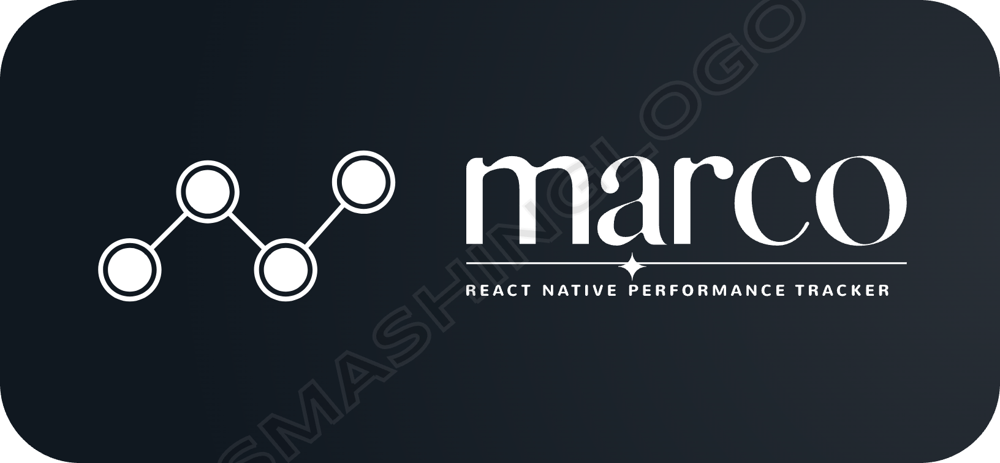

A powerful React Native library to track and log performance metrics for screens and components. It leverages the new architecture with **TurboModules** and **Fabric** for improved efficiency. The library provides insights into render times, draw times, and helps identify performance bottlenecks in your app.

## Documentation

All information about marco is available on our [website](https://github.com/dream-sports-labs/react-native-performance-tracker).

- [Installation](https://github.com/dream-sports-labs/react-native-performance-tracker)

- [Guides](https://github.com/dream-sports-labs/react-native-performance-tracker)

- [Tooling](https://github.com/dream-sports-labs/react-native-performance-tracker)

## Roadmap

**marco** is under active development! Expect a lot of new features to appear soon🔥

- Expo support
- Realtime monitoring of events
- Support for multiple events selection in dashbaord
- Native event logging mechanism

## Community Discord

Join the [DreamSportsLabs Community](https://discord.com/channels/1317172052179943504/1317172052179943507) to chat about marco or other DreamSportsLabs libraries.

## Created by DreamSportsLabs

DreamSportsLabs is committed to building open-source tools that empower developers and businesses. Learn more about us at our website.

## 🙌 Contributions

Contributions are welcome! Feel free to submit a PR or raise issues for any bugs or feature requests.
