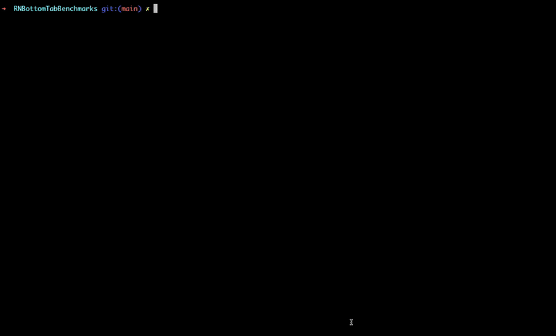

# react-native-performance-tracker 📊

A powerful React Native library to track and log performance metrics for screens and components. It leverages the new architecture with **TurboModules** and **Fabric** for improved efficiency. The library provides insights into render times, draw times, and helps identify performance bottlenecks in your app.

## ✨ Features
- **Track Render Times**: Measure the time taken to render screens and components.
- **Track Draw Times**: Capture the exact time when content is fully painted on the screen.
- **Custom Markers**: Send custom timestamps for events.
- **Logs Management**: Retrieve and reset logs as needed.
- **Supports New Architecture**: Fully compatible with TurboModules and Fabric.
- **Cross-Platform Support**: Seamlessly works across iOS and Android, ensuring consistent performance tracking on both platforms.
- **Performance Visualization Dashboard**: Interactive dashboard to visualize logs, analyze performance metrics, and generate detailed reports.
- **Data Retrieval**: Automated scripts to fetch and structure performance logs based on the selected platform.

## 📦 Installation

```bash
yarn add react-native-performance-tracker
cd ios && pod install
```

## 🚀 Usage Example

### 1. **Track Screen Rendering with the Component**
Wrap your screen or component with PerformanceTracker to automatically capture render and draw times:

```tsx
import { PerformanceTracker } from 'react-native-performance-tracker';

const MyScreen = () => {
  return (
    <PerformanceTracker
      tagName="MyScreen"
      isEnabled={true}
      meta={{ data: 'meta_data' }}
      onTrackingEnd={(event) => {
        console.log('Draw Time:', event.nativeEvent.drawTime);
        console.log('Render Time:', event.nativeEvent.renderTime);
      }}
    >
      {/* Your screen content goes here */}
    </PerformanceTracker>
  );
};

```

  The `meta` parameter must be an object with key-value pairs, where both the `key` and `value` are strings.

### 2. **Send Custom Markers**

Send custom performance markers at any point in your app:

```tsx
// Without metadata
PerformanceTracker.track('start_event', Date.now());

// With metadata
PerformanceTracker.track('start_event', Date.now(), { data: 'meta_data' });
```

  The `meta` parameter must be an object with key-value pairs, where both the `key` and `value` are strings.

### 3. **Retrieve Logs**
Retrieve performance logs asynchronously:

```tsx
const logs = await PerformanceTracker.getLogs();
console.log('Performance Logs:', logs);
```

### 4. **Enable Performance Log Persistence**
Enable performance log persistence globally by setting the configuration.

```tsx
import { PerformanceTracker } from 'react-native-performance-tracker';

PerformanceTracker.configure({
  persistToFile: true, // Logs will persist to a file for debugging purposes.
});
```

### 5. **Log File Paths**

When `persistToFile` is enabled, the logs will be saved to a file for later retrieval. The file paths differ between **Android** and **iOS**:

#### Android
The benchmark logs are saved to the following path on the device:

```bash
/sdcard/Documents/PerformanceTracker/log.json
```
#### iOS

The benchmark logs are saved to the following path on the iOS device or simulator:

```bash
Documents/PerformanceTracker/log.json
```

### 6. **Reset Logs**
Clear all performance logs:

```tsx
// Basic usage
PerformanceTracker.resetLogs();

// Clear logs and files (if persistToFile is true)
PerformanceTracker.resetLogs({ clearFiles: true }); // Default: false
```

## 🧑🏻‍💻 Perf-Tracker CLI Tool
The `perf-tracker` CLI tool helps you generate performance reports and visualize the data for your Android and iOS apps. It supports both command-line arguments and configuration through a configuration file `(perf-tracker.config.js)`.

### Configuration Options
You can configure the `perf-tracker` CLI tool either through command-line arguments or by using a configuration file. Here's how to set it up:

1. **CLI Arguments** 🎯

  When running the CLI commands, you can pass configuration options directly from the command line. These options will override any corresponding values in the configuration file.

  - `--platform <platform>`: Specify the platform for which the performance data should be generated.

    Options: `android`, `ios`

   Example:
   ```bash
   yarn perf-tracker generate --platform android
   ```

 - `--ios-package <package>`: Specify the iOS package name (required for the iOS platform). This is needed when generating reports for iOS apps.

   Example:
   ```bash
   yarn perf-tracker generate --platform ios --ios-package com.example.app
   ```

  -  `--outputPath <path>:`
   Specify the output path where the generated performance reports will be saved. This is optional. By default, reports are saved to `./generated-perf-reports`.
   Example:

  ```bash
    yarn perf-tracker generate --outputPath ./custom-reports
  ``` 
  - `--port <port>`:
  Specify the port for the visualization dashboard (default: 8080). If you want to change the port for serving the dashboard, you can use this option.
   Example:

   ```bash
   yarns perf-tracker visualize --port 3000
  ```

2. **Configuration File `(perf-tracker.config.js)`** 📄

  Alternatively, you can create a perf-tracker.config.js file at the root of your project to define default values for the above options. This file allows you to centralize the configuration for the CLI tool and avoid repeatedly specifying options via the command line.

 Example of a `perf-tracker.config.js`:

 ```js
// perf-tracker.config.js
module.exports = {
  platform: 'android',               // Default platform (android or ios)
  iosPackage: '',                    // Specify your iOS package name if required
  outputPath: './generated-perf-reports', // Default path for the generated reports
  port: 8080,                        // Default port for the visualization dashboard
};
 ```

 With this configuration file in place, you don’t need to specify these options every time you run a command. However, if you pass any of the options through the CLI, they will override the values in the configuration file.

## How to Use the Perf-Tracker CLI Tool?

1. **Generate Performance Reports**

 To generate performance reports for your app, use the `generate` command. You can specify the platform (Android or iOS), the iOS package name (for iOS), and the output path for the generated reports.

 **Example command to generate a report for Android:**

 ```bash
 yarn perf-tracker generate --platform android
 ```
 **Example command to generate a report for iOS:**

 ```bash
 yarn perf-tracker generate --platform ios --ios-package com.example.app
 ```

2. **Visualize the Performance Data**

 After generating the reports, you can `visualize` the performance data using the visualize command. This will start a local server to display the performance data in a dashboard.

 **Example command to start the visualization server:**

 ```bash
 yarn perf-tracker visualize
 ```

 By default, the server runs on port 8080, but you can specify a different port using the --port argument:

  **Example command to start the server on a different port:**

 ```bash
 yarn perf-tracker visualize --port 3000
 ```
 Once the server is running, open your browser and go to http://localhost:8080 (or the specified port) to view the performance dashboard.

## How to Access the Visualization Dashboard?

The visualization dashboard allows you to analyze and interpret performance data effectively. Here's how to use it:

1. Navigate to the HTML server URL: http://localhost:8080.

2. Use the interface to:

- **Select Start and End Markers**: Define the range of data you wish to analyze.
- Click the **Visualize** button.

3. The dashboard will display:

- Mean, standard deviation, and error rate.
- A graph visualizing performance trends.
- A table showing raw data in tabular format for detailed insights.



## 🛠 API Reference

### **Native Module Methods**

| Method         | Description                                                  | Parameters                                             | Returns                      |
|----------------|--------------------------------------------------------------|--------------------------------------------------------|------------------------------|
| `track`         | Sends a custom performance marker with a tag and timestamp.  | `tag: string`, `time: number`                          | `void`                       |
| `getLogs`      | Retrieves all performance logs asynchronously.               | None                                                   | `Promise<Record<string, any>>` |
| `resetLogs`    | Clears all performance logs.                                  | None                                                   | `void`                       |
| `configure`         | Initializes the tracker with optional configuration.         | `config?: InitConfig`                                  | `void`                       |
| `meta`     | Additional data to be passed.           | `{[key: string]: string}` | `undefined` | No       |

---

### **Component Props**

| Prop            | Description                                                | Type                           | Default    | Required |
|-----------------|------------------------------------------------------------|--------------------------------|------------|----------|
| `tagName`       | Unique tag for identifying the tracked component.           | `string`                       | `required` | Yes      |
| `isEnabled`     | Enables or disables performance tracking.                  | `boolean`                      | `true`     | No       |
| `eventTimeStamp`| Timestamp when the event is triggered.                     | `number`                       | `Date.now()` | No      |
| `onTrackingEnd`     | Callback when the screen has finished rendering.           | `DirectEventHandler<FinishEventType>` | `undefined` | No       |
| `meta`     | Additional data to be passed.           | `{[key: string]: string}` | `undefined` | No       |

---

### **Event Object (`onTrackingEnd` Callback)**

| Key          | Description                                                  | Type     |
|--------------|--------------------------------------------------------------|----------|
| `tagName`    | The tag name associated with the event.                      | `string` |
| `drawTime`   | Time taken to draw the component.                            | `number` |
| `renderTime` | Time taken to render the component.                          | `number` |

## 🙌 Contributions
Contributions are welcome! Feel free to submit a PR or raise issues for any bugs or feature requests.