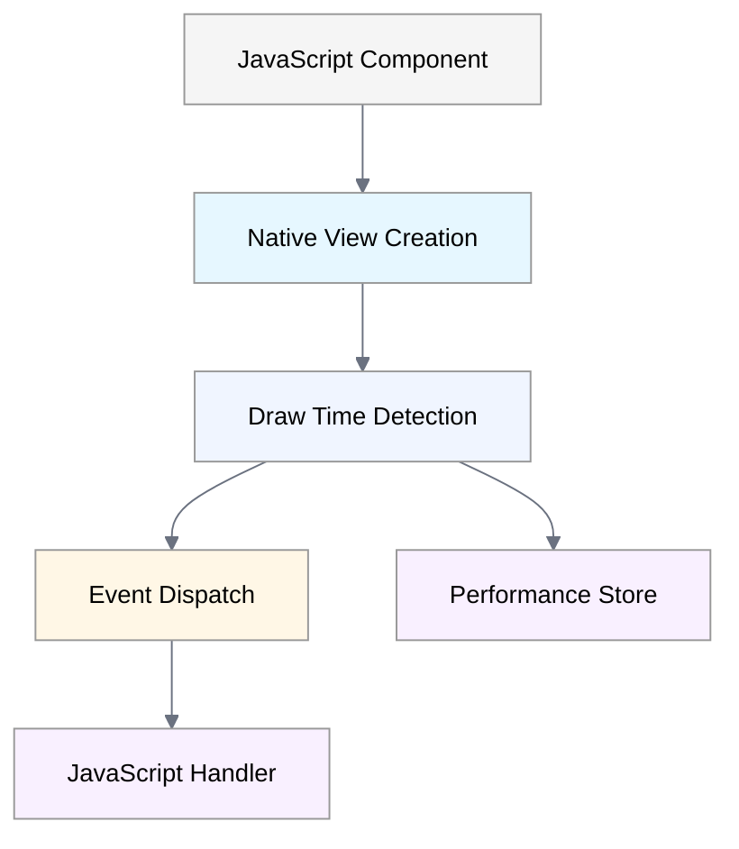
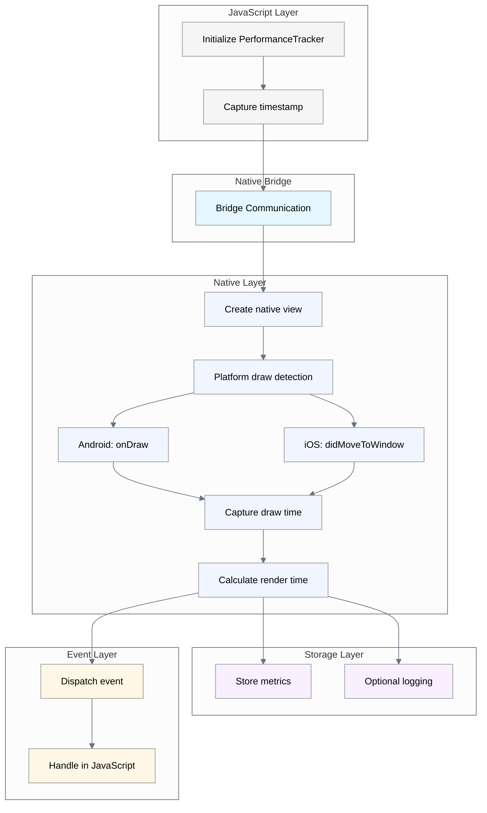

Marco tracks when UI components are drawn on screen by hooking into platform-specific lifecycle methods. This allows measuring the time between component creation in JavaScript and when it becomes visible to users, helping identify performance bottlenecks.

## High-Level Architecture

The following diagram shows the core components involved in draw time tracking:

**Flow Description:**

1. **JavaScript Component** - Wrapped with PerformanceTracker
2. **Native View Creation** - Platform-specific rendering begins
3. **Draw Time Detection** - Calculate render time
4. **Event Dispatch** - onTrackingEnd callback triggered
5. **Performance Store** - Store metrics

## Implementation Details

Marco uses different approaches for Android and iOS to detect when components are drawn on screen:

- **Android**: Uses the `onDraw()` method of the `PerformanceTrackerView` class
- **iOS**: Uses the `didMoveToWindow()` method when a view is added to the window hierarchy

Both implementations ensure minimal overhead by only tracking the first draw of components.

## Detailed Component Interaction

The following shows the complete flow of draw time tracking, from JavaScript initialization to final event handling:

:::note
Both platforms follow a similar approach but use platform-specific lifecycle methods to detect when a component is drawn on screen.
:::

### Key Points

1. **JavaScript Initialization**: The PerformanceTracker component captures the initial timestamp when the component is created
2. **Native Bridge**: Communication passes through React Native's bridge to native code
3. **Platform Detection**: Each platform uses its native lifecycle methods to detect when drawing occurs
4. **Metrics Storage**: Performance data is stored for later retrieval and analysis
5. **Event Callback**: Optional callback allows real-time handling of performance metrics in JavaScript
