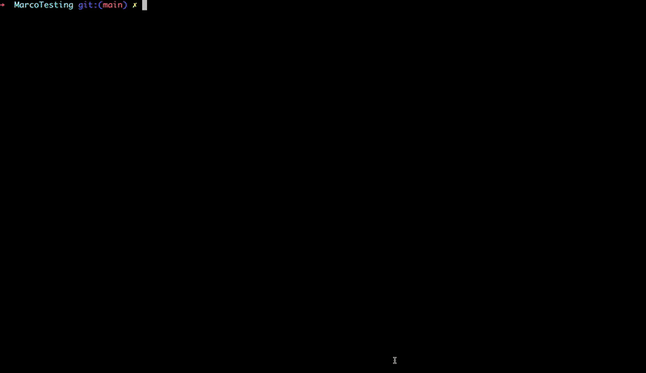

This command is needed when we want to use CLI to visualize performance reports for `Android` or `iOS` applications, or to override the values in the config file.

```bash frame="none"
yarn marco visualize --help
```

```bash frame="none"
Usage: marco visualize [options]

Serve the performance report dashboard

Options:
  -p, --port <port>        Specify the port (default: "8080")
  -d, --dataDir <dataDir>  Specify the data directory path and custom report name
  --platform <platform>    Specify platform: android or ios
  -h, --help               display help for command
```

### Options

- `--platform <platform>`: Specify platform: android or ios. If want to read values from the config file, specify the platform.
- `-p, --port <port>`: Specify the port for the dashboard (default: 8080).
- `-d, --dataDir <dataDir>`: 'Specify the directory containing the performance reports as "path:custom_report_name" (e.g., "report/log.json:My Report") — wrap in quotes if the name contains spaces'

Example:

```bash frame="none"
yarn marco visualize --platform android --port 3000
```

With data source path:

This is useful when we want to visualize the data from a different directory.
```bash frame="none"
yarn marco visualize --dataDir "./path/to/log.json:custom_report_name"
```

### Marco Dashboard



Features of the Visualization Dashboard:
- In **Side bar**, we can see all the markers with there occurrence.
- **Iteration** wise data is shown in bar chart.
- **Raw data** are processed and shown in timeline for better understanding.
- Also have access to other metrics like mean, standard deviation, error rate to predict the correctness of the data.
- We can play arounnd with mutliple events to see how they perform together.
