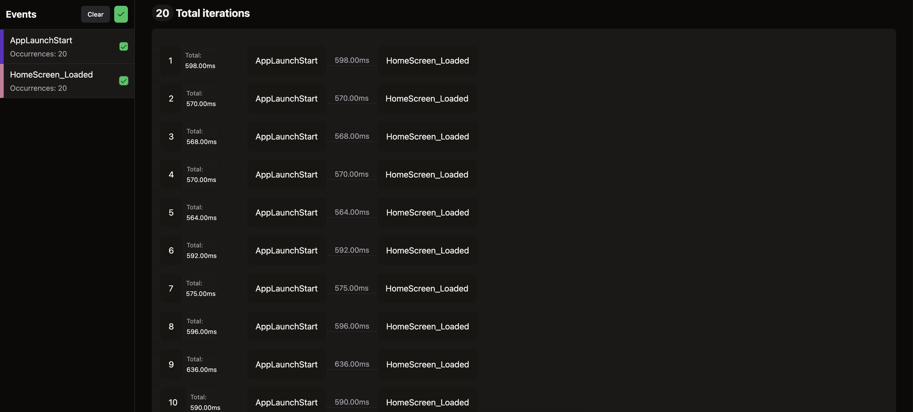

import { Tabs, TabItem, Steps } from '@astrojs/starlight/components';
import { Aside } from '@astrojs/starlight/components';

This guide demonstrates how to leverage Marco to track app startup performance. By adding markers at key points during the app’s lifecycle, one can gain insights into how long various parts of the startup process take.
Additionally, we can fetch data using Marco's `generate` command, and `visualize` the results for better analysis.

<Aside type="note" title="Prerequisites">
  Ensure Marco is integrated into your Android and iOS apps. Refer to [Marco
  Quick Start](../project/quick-start.md) for setup instructions.
</Aside>

#### Tracking App Startup Performance

##### Step 1: Add Start Marker

For App Startup, we will add a start marker at the beginning of the app's lifecycle.

- **For Android**, add a marker to track the start of the app in the `onCreate` method of `MainApplication` class. This is the first method that is called when the app is launched.
- For iOS, add a marker to track the start of the app in the `application` method of AppDelegate.m.

    <Tabs syncKey="package-manager">
  <TabItem label="MainApplication.kt" icon="seti:kotlin">
    ```kotlin frame="none"
    import com.performancetracker.PerformanceTracker;

    override fun onCreate() {
        super.onCreate()

        PerformanceTracker.track(
            "AppLaunchStart", 
            System.currentTimeMillis(), 
            null,
            true, // writeLogInFile is true to save the data to a file
            applicationContext // applicationContext is the context of the app to write the data to a file
             )
        // other code
    }
        ```
      </TabItem>
      <TabItem label="AppDelegate.m" icon="seti:cpp">
        ```objc frame=none
        - (BOOL)application:(UIApplication *)application didFinishLaunchingWithOptions:(NSDictionary *)launchOptions
            {

            [[PerformanceTracker sharedInstance] track:@"AppLaunchStart"
                                                    timestamp:(long long) [[NSDate date] timeIntervalSince1970] * 1000
                                                    meta: nil
                                                    writeLogInFile:YES];
            return [super application:application didFinishLaunchingWithOptions:launchOptions];
            }
        ```
      </TabItem>

    </Tabs>
:::note
    - Make sure to pass `writeLogInFile: true` to the `track` method to save the data to a file. This will help in visualizing the data.
:::

##### Step 2: Add End Marker

For end marker, add a marker when the screen is fully drawn. This gives a sense of how long it takes for the app to be ready to interact with the user.
For this just wrap the screen or any component with `PerformanceTracker` and provide a tag name.

```tsx collapse={19-36}
import { PerformanceTracker } from '@d11/marco';

PerformanceTracker.configure({
  persistToFile: true,
});

function HomeScreen(): React.JSX.Element {

  return (
    <PerformanceTracker tagName="HomeScreen_Loaded"  style={styles.outerContainer}>
      <View style={styles.container}>
        <Text testID="home_screen_text" style={styles.text}>Home Screen</Text>
      </View>
    </PerformanceTracker>
  );
}

const styles = StyleSheet.create({
  container: {
    justifyContent: 'center',
    alignItems: 'center',
    backgroundColor: '#f0f0f0',
    borderWidth: 1,
    borderColor: 'black',
    borderRadius: 10,
    padding: 10,
  },
  text: {
    fontSize: 24,
    fontWeight: 'bold',
  },
  outerContainer: {
    flex: 1,
    justifyContent: 'center',
    alignItems: 'center',
  },
});
```

This will track the time it took to draw the PerformanceTracker component entirely.
    :::note
    - Make sure to pass `persistToFile: true` to the `Performance.configure` method to save the data to a file. This will help in visualizing the data.
    :::

##### Step 3: Instrumentation

Use any instrumentation tool to run the iteration. For example, [maestro](https://maestro.mobile.dev/platform-support/react-native).
After running the iteration, it will save the data in device itself.

##### Step 4: Create a `marco.config.js`

Create a `marco.config.js` file at the root of project with the following content.

    <Tabs syncKey="config">
      <TabItem label="Android" icon="android">
        ```js
        // marco.config.js
        module.exports = {
        platform: 'android', 
        outputPath: './app-startup-reports',
        port: 8080,
        dataDir: './app-startup-reports'
        };
        ```
      </TabItem>
      <TabItem label="iOS" icon="apple">
        ```js
        // marco.config.js
        module.exports = {
        platform: 'ios', 
        iosPackage: 'com.example',
        outputPath: './app-startup-reports',
        port: 8080,
        dataDir: './app-startup-reports'
        };
        ```
      </TabItem>
    </Tabs>

##### Step 5: Generate Data

Use `generate` command to generate the data.

```sh frame="none"
yarn marco generate
```
- It will save the data in specified path (./app-startup-reports/log.json).

Here is the sample report generated:

```json collapse={10-65}
[
    {
        "tagName": "AppLaunchStart",
        "timestamp": "1738089908375"
    },
    {
        "tagName": "HomeScreen_Loaded",
        "timestamp": "1738089908973"
    },
    {
        "tagName": "AppLaunchStart",
        "timestamp": "1738089914779"
    },
    {
        "tagName": "HomeScreen_Loaded",
        "timestamp": "1738089915349"
    },
    {
        "tagName": "AppLaunchStart",
        "timestamp": "1738089918248"
    },
    {
        "tagName": "HomeScreen_Loaded",
        "timestamp": "1738089918816"
    },
    {
        "tagName": "AppLaunchStart",
        "timestamp": "1738089921612"
    },
    {
        "tagName": "HomeScreen_Loaded",
        "timestamp": "1738089922182"
    },
    {
        "tagName": "AppLaunchStart",
        "timestamp": "1738089926458"
    },
    {
        "tagName": "HomeScreen_Loaded",
        "timestamp": "1738089927022"
    },
    {
        "tagName": "AppLaunchStart",
        "timestamp": "1738089944241"
    },
    {
        "tagName": "HomeScreen_Loaded",
        "timestamp": "1738089944833"
    },
    {
        "tagName": "AppLaunchStart",
        "timestamp": "1738089949008"
    },
    {
        "tagName": "HomeScreen_Loaded",
        "timestamp": "1738089949583"
    },
    {
        "tagName": "AppLaunchStart",
        "timestamp": "1738089954020"
    },
    {
        "tagName": "HomeScreen_Loaded",
        "timestamp": "1738089954616"
    }
]
```

##### Step 6: Visualize Data

Use `visualize` command to visualize the data.

```sh frame="none"
yarn marco visualize
```

- It will open the dashboard in the browser.
- Below I had attached the screenshot of the dashboard.
  - At left side, it will show all the markers with there occurrence.
  - Iteration wise data is shown in bar chart.
  - Raw data are processed and shown in timeline.
  - Also have access to other metrics like mean, standard deviation, error rate to predict the correctness of the data.


