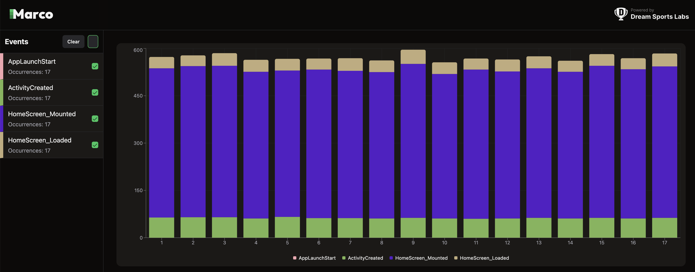
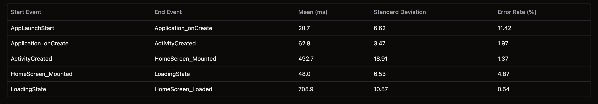
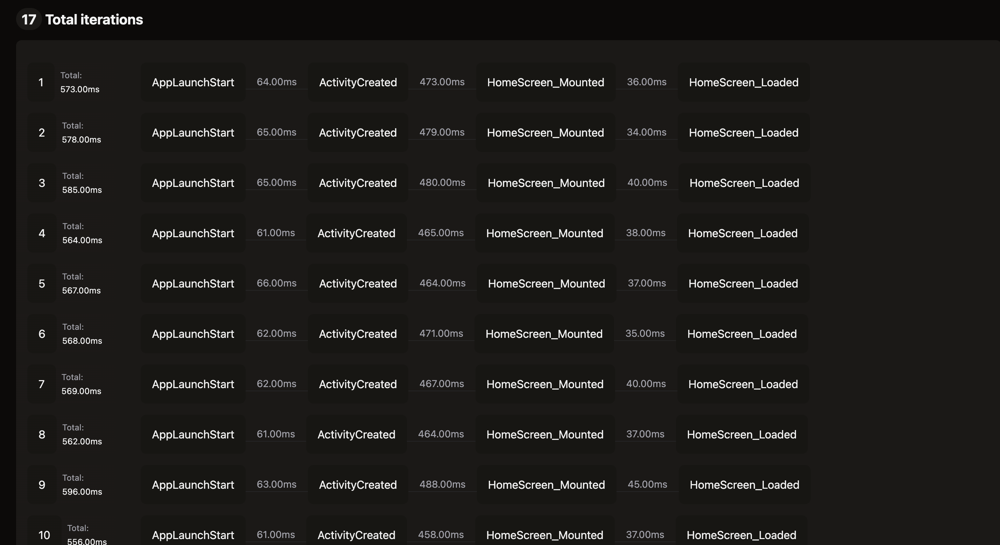

import { Tabs, TabItem, Steps } from '@astrojs/starlight/components';
import { Aside } from '@astrojs/starlight/components';

This guide is created to track multiple events in a single iteration and how to visualize the data. For this example, we will extend the app startup example to track multiple events.
Checkout the [App Startup](/guides/app-startup) guide for more details.

Let's say we tracked startup time of the app and now we want to go a bit deeper to understand the breakdown of the startup time.

#### Tracking Multiple Events

We already have one start marker(T1: AppLaunchStart) and one end marker(T4: HomeScreen_Loaded). Lets add few more markers
- T2: Marker when Activity is created
- T3: Marker when HomeScreen is mounted

##### Add Activity OnCreate Marker

- **For Android**, add a marker to track the start of the activity in the `onCreate` method of `MainActivity` class. This is the first method that is called when the activity is going to be created.

    ```kotlin frame="none"
    override fun onCreate(savedInstanceState: Bundle?) {
        super.onCreate(savedInstanceState)

        PerformanceTracker.track(
            "ActivityCreated", 
            System.currentTimeMillis(), 
            null,
            true, // writeLogInFile is true to save the data to a file
            applicationContext // applicationContext is the context of the app to write the data to a file
             )
        // other code
    }
        ```
:::note
    - Make sure to pass `writeLogInFile: true` to the `track` method to save the data to a file. This will help in visualizing the data.
:::

##### Add HomeScreen Mounted Marker

```tsx collapse={23-40, 14-18, 3-5}
import { PerformanceTracker } from '@d11/marco';

PerformanceTracker.configure({
  persistToFile: true,
});

function HomeScreen(): React.JSX.Element {

 useEffect(() => {
    PerformanceTracker.track("HomeScreen_Mounted", Date.now());
 }, []);

  return (
    <PerformanceTracker tagName="HomeScreen_Loaded"  style={styles.outerContainer}>
      <View style={styles.container}>
        <Text testID="home_screen_text" style={styles.text}>Home Screen</Text>
      </View>
    </PerformanceTracker>
  );
}

const styles = StyleSheet.create({
  container: {
    justifyContent: 'center',
    alignItems: 'center',
    backgroundColor: '#f0f0f0',
    borderWidth: 1,
    borderColor: 'black',
    borderRadius: 10,
    padding: 10,
  },
  text: {
    fontSize: 24,
    fontWeight: 'bold',
  },
  outerContainer: {
    flex: 1,
    justifyContent: 'center',
    alignItems: 'center',
  },
});
```

##### Instrumentation

Again perform the same steps as in [App Startup](/guides/app-startup) guide to run the iteration.

##### Generate Data

Use the same marco config file as in [App Startup](/guides/app-startup) guide.

Run `generate` command to generate the data.

```sh frame="none"
yarn marco generate
```

##### Visualize Data

Run `visualize` command to visualize the data.

```sh frame="none"
yarn marco visualize
```

- Below I had attached the screenshot of the dashboard .
  - At left side, we can see all the markers with there occurrence.
  - bar chart shows that majority of the time is spent in `ActivityCreated` to `HomeScreen_Mounted`.
  - Correctness of the data is predicted using mean, standard deviation, error rate.
  - And at last we can see the difference between any 2 events iteration wise.







We can break it down further if needed and visualize it in this way.